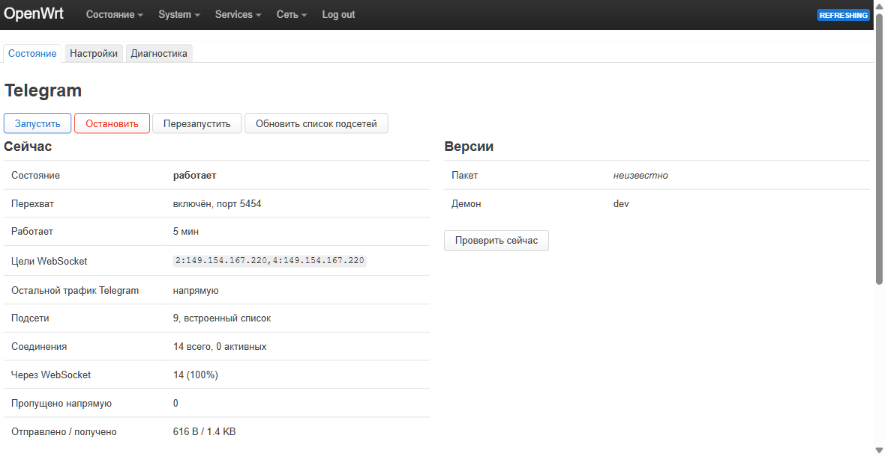
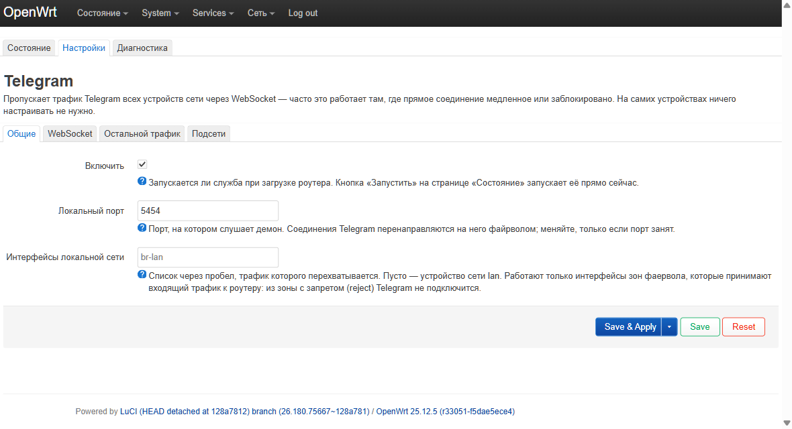
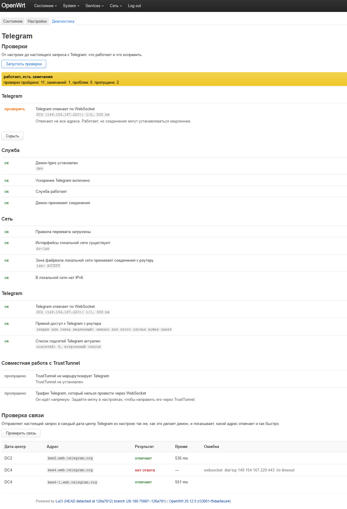

# Detailed guide: tgws on OpenWrt

This guide covers everything about `luci-app-tgws`: what it does, how to install and configure it,
how it works inside, how to check that it works and what to do when it does not.
A short description is in the [README](README.en.md). The per-option reference is in
[SETTINGS.ru.md](SETTINGS.ru.md) (Russian; the option names and values are the same).

## Contents

- [What the package does](#what-the-package-does)
- [Installation](#installation)
  - [Which routers are supported](#which-routers-are-supported)
- [Configuration in the interface](#configuration-in-the-interface)
  - [Status](#status)
  - [Settings](#settings)
  - [Diagnostics](#diagnostics)
- [How it works inside](#how-it-works-inside)
  - [Interception](#interception)
  - [What the client says](#what-the-client-says)
  - [How the data center is found](#how-the-data-center-is-found)
  - [WebSocket and fallback](#websocket-and-fallback)
  - [Protection against failures](#protection-against-failures)
  - [Where things live](#where-things-live)
- [Working with TrustTunnel](#working-with-trusttunnel)
- [Configuration without the interface](#configuration-without-the-interface)
- [Diagnostics and common problems](#diagnostics-and-common-problems)
- [Limitations](#limitations)
- [Updating](#updating)
- [Removal](#removal)
- [For developers](#for-developers)
- [License and credits](#license-and-credits)

## What the package does

Telegram talks to its data centers over TCP to addresses in a few subnets. In many networks that
connection is slow or blocked, while Telegram can still be reached over WebSocket to the web
endpoints `kws*.web.telegram.org`: the same stream wrapped in ordinary HTTPS.

The package does this wrapping **on the router, transparently**:

1. An `nftables` rule redirects connections from the home network's devices to Telegram's subnets
   to a local daemon, `tgws`.
2. The daemon finds the data center, opens a WebSocket to Telegram and moves the stream both ways.
3. If the WebSocket does not work, the client's bytes are **replayed verbatim** over a direct
   connection, so Telegram does not break.

Nothing has to be set up on phones or computers: no proxy, no secret, no `tg://proxy` link.

**What the router sees.** The daemon removes and applies only the transport obfuscation of the
connection (obfuscated2). Telegram's messages stay encrypted by its own MTProto protocol from the
client to the server, and the router does not read them.

## Installation

You need:

- a router with **OpenWrt 25.12 or newer**, LuCI and the `apk` package manager;
- SSH access and about 5 MB of free space (the daemon binary is 4–5 MB);
- a supported architecture (see below).

OpenWrt 24.10 and earlier versions with `opkg` are not supported.

Run over SSH **on the router**:

```sh
sh -c "$(wget -O - https://raw.githubusercontent.com/NooBiToo/tgws-openwrt/main/install.sh)"
```

The installer:

1. checks the OpenWrt version and the architecture **before** changing anything;
2. installs the dependencies `curl`, `ca-bundle`, `firewall4`;
3. downloads the latest release and checks that there is enough space (room for two copies of the binary);
4. stops a running service, puts the binary `/usr/bin/tgws` in place **before** installing the package
   (otherwise the package would start the old daemon), installs `luci-app-tgws` and the Russian translation;
5. restarts the LuCI backend and the service if it was running.

After installation the service is off. Open **Services → Telegram → Settings**, turn the acceleration
on and press **Save & Apply**.

### Which routers are supported

The binary is built for five variants; the installer picks one by `DISTRIB_ARCH` from
`/etc/openwrt_release` (not by `uname -m`: on mips the kernel answers `mips` for both big- and
little-endian, and the binary needs the byte order).

| `DISTRIB_ARCH` | Release file | Example devices |
|---|---|---|
| `x86_64` | `tgws-linux-x86_64` | x86 routers, virtual machines |
| `aarch64_*` | `tgws-linux-aarch64` | MediaTek Filogic, Rockchip, Raspberry Pi 3/4, Cudy, Xiaomi AX |
| `arm_*` | `tgws-linux-arm` | Cortex-A7/A9/A53 in 32-bit mode, including ones without an FPU |
| `mipsel_*` | `tgws-linux-mipsel` | MT7621 and other little-endian mips |
| `mips_*` | `tgws-linux-mips` | Atheros/QCA big-endian mips |

The `arm` and `mips` binaries use software floating point, so they run on devices without an FPU
(BCM53xx, some Atheros). Other architectures (`mips64`, `riscv64`, `powerpc`) are rejected by the
installer before anything is installed.

If the binary does not fit in 8–16 MB of flash, the installer stops with a clear message rather than
leaving a truncated file.

## Configuration in the interface

The package adds **Services → Telegram** with three pages.



### Status

The first page shows whether the acceleration works and controls the service.

- The **verdict bar** appears **only when something is wrong**: the daemon is not installed, the
  service is off or not running, the rules are not loaded. It says what to do. When all is well there
  is no bar, and the state is an ordinary table row, "working".
- **Buttons:** Start, Stop, Restart, **Update subnet list**.
- **Now:** state, interception and port, uptime, WebSocket targets, where the rest of Telegram traffic
  goes, the number of subnets and where they come from, the connection counters (total, active,
  through WebSocket with a share, passed through directly, sent and received). Addresses for which no
  data center could be found are listed on a separate row.
- **Versions:** the package and the daemon, with a check for the latest release on GitHub. The result
  is cached for six hours; **Check now** skips the cache.
- **Log:** the last lines of `logread -e tgws`, refreshed every 10 seconds.

### Settings

The options are split into four tabs; each has a hint and validates the value in place.

| Tab | Options |
|---|---|
| **General** | Enable, Local port, LAN interfaces |
| **WebSocket** | WebSocket targets, Manual address to data center map |
| **Other traffic** | Mark for traffic that cannot use WebSocket |
| **Subnets** | Telegram subnet list URL |



Each option, its default and examples are described in [SETTINGS.ru.md](SETTINGS.ru.md).
Changes are applied with **Save & Apply**: the service re-reads its settings by itself.

### Diagnostics



The page exists to answer "why does it not work" without reading the source. Everything runs **on
buttons**, because some checks go out to the network and take a few seconds.

The **checks** go from the settings to a real request to Telegram, in four groups.

- **Service:** the daemon is installed, the acceleration is on, the service runs, the daemon accepts connections.
- **Network:** the interception rules are loaded, the LAN interfaces exist, **the firewall zone accepts
  connections to the router**, there is no IPv6 on the LAN.
- **Telegram:** whether Telegram answers over WebSocket for each data center in the settings (**a real
  request**, not a port check), whether Telegram is reachable directly, whether the subnet list is
  current, whether there are addresses with no known data center, whether connections go through
  WebSocket at all.
- **Integration with TrustTunnel:** whether it routes Telegram itself, and whether a routing rule exists
  for the mark, if one is set.

Each check has a verdict (**ok / check / problem / skipped**) and a hint for the problem ones. Problems
come first; the checks that passed are collapsed.

The **connection test** sends a real request to every data center the way the daemon does and shows,
per address, whether it answered, in how many milliseconds, and what the error was. The domains of one
data center are tried in order and only up to the first one that answers: the daemon does the same,
and an extra connection to the same address can be limited by the provider and give a false failure.

Run the checks and the connection test **one after the other**, not at the same time: frequent parallel
connections to one address are limited in some networks.

## How it works inside

### Interception

The rules live in **their own table, `inet tgws`**, separate from other packages' tables:

```
table inet tgws {
    set tg_v4 { type ipv4_addr; flags interval; auto-merge; elements = { ... } }
    chain intercept {
        type nat hook prerouting priority dstnat; policy accept;
        iifname != { "br-lan" } return
        ip daddr @tg_v4 tcp dport { 80, 443, 5222 } redirect to :5454
    }
}
```

- Only **IPv4** and only TCP on ports 80, 443 and 5222 is intercepted.
- Only traffic that came from the **LAN interfaces** (by default the device of the `lan` network).
- Telegram's subnets come from a list that is refreshed weekly (see below); if the refresh failed, the
  built-in list is used.
- The chain is called `intercept`, not `redirect`: `redirect` is a reserved `nft` word.

A redirected connection reaches the daemon with the router's address, and the daemon learns the original
destination through `SO_ORIGINAL_DST`.

**The table is loaded only after the daemon has started listening**, and removed **first** on stop.
So there is never a moment when connections are redirected into a closed port. The daemon reports
readiness through the counters file `/var/run/tgws.json`: it is written right after `bind` and removed
on stop before the port is closed.

`/etc/init.d/firewall start`, `reload` and `restart` **do not touch** the `inet tgws` table.
But `/etc/init.d/firewall stop` removes **all** `nftables` tables, ours included; after that there is
no interception, and `/etc/init.d/tgws restart` brings it back (the Status page says so).

### What the client says

The daemon reads the first bytes of a connection like this:

| What arrived | What it is | What the daemon does |
|---|---|---|
| `0xef` | plain abridged transport | the data center is found by the destination address |
| `eeeeeeee`, `dddddddd` | plain intermediate / padded | the same |
| 64 bytes that decode as obfuscated2 | a client with obfuscation, no proxy | the data center comes from the header if it is meaningful |
| the start of an HTTP method (`GET `, `POST` …) | plain HTTP | passed straight through directly, without waiting |
| anything else (for example a TLS ClientHello) | not MTProto | passed through directly, the bytes replayed verbatim |

**On a direct connection Android writes a meaningless data center index into the header** (it does not
need it: it connects to a specific address). So for Android the data center is found by the address,
not by the header. Desktop writes the index correctly.

### How the data center is found

In order, until an answer is found:

1. **The manual map** `ip_dc` from the settings.
2. **The index in the client's header**, if it is a valid number (1–5 or 203).
3. **The built-in address table.** It contains only addresses that are known with confidence (six
   addresses from upstream and three confirmed by a live test). Subnets are not guessed: a wrong data
   center breaks an account's sign-in worse than skipping the acceleration.
4. **What was learned by trial.** For an unknown address the daemon reads the client's first packet and
   sends it in turn to the data centers that have a WebSocket target. The transport error **`-404`**
   (the client's key is unknown) or **`-444`** means "wrong data center", and the next one is tried.
   The first one that answers properly is remembered for that address.

If none fits, the connection goes to the fallback with all bytes read replayed verbatim.

The trial is reliable on **authorized** sessions. The first unencrypted key-exchange request
(`req_pq`) is accepted by any data center, so for a brand new client the trial "learns" the first one
that answers. That is consistent while the daemon remembers the choice; after a restart the first
authorized packet refines it through `-404`.

### WebSocket and fallback

The WebSocket is opened to the data center's IP (by default `149.154.167.220` for DC2 and DC4) with an
SNI and a `Host` header like `kws{N}.web.telegram.org` and the path `/apiws`. Then the daemon builds its
own obfuscated2 header for the Telegram side and re-encrypts the stream with AES-CTR both ways, splitting
the outgoing stream into transport packets (one per WebSocket frame).

The domains of one data center are tried in order: `kws{N}` and `kws{N}-1` (reversed for media).

The **fallback** happens when the WebSocket is unavailable, the data center is not found, or the
connection does not look like MTProto. The bytes read from the client are replayed verbatim, then the
stream is simply copied both ways. Where exactly the fallback goes is decided by the **mark for other
traffic** option (see below).

### Protection against failures

| What | How the daemon behaves |
|---|---|
| All domains of a data center answered with a redirect | the data center is not tried again until restart |
| Any other WebSocket failure (timeout, error) | the data center is paused for 60 seconds, then tried again |
| The data center is paused, but **the direct path to the address has just failed** | the pause is ignored and the WebSocket is tried again: handing the data center to a known dead path makes no sense |
| A direct attempt to an address failed | for 60 seconds new connections to it are closed **at once** instead of waiting for the timeout |
| A timeout on the first domain | the next domain of the same data center is tried |
| A client connected and is silent | the connection is closed on the hello timeout (10 seconds) |
| A connection that did not come through the redirect | it is closed: otherwise the fallback would dial the daemon itself in a loop |
| A destination port other than 80, 443, 5222 | it is closed: the interception never sends that |

Timeouts: opening a WebSocket 4 seconds, a direct connection 5 seconds.

### Where things live

| Path | What it is |
|---|---|
| `/usr/bin/tgws` | the daemon |
| `/etc/config/tgws` | settings (UCI) |
| `/etc/init.d/tgws` | the procd service |
| `/usr/libexec/tgws/gen-nft` | the interception table generator |
| `/usr/libexec/tgws/update-subnets` | the subnet list update |
| `/usr/libexec/tgws/subnets.sh` | the shared subnet list filter |
| `/etc/tgws/subnets.txt` | the downloaded subnet list (if an update succeeded) |
| `/var/run/tgws.json` | counters and the daemon's readiness marker |
| `/var/run/tgws.nft` | the generated rules |
| `/etc/crontabs/root` | the weekly subnet list update entry |
| `/usr/share/rpcd/ucode/luci.tgws` | the interface backend |
| `/www/luci-static/resources/view/tgws/` | the interface pages |

## Working with TrustTunnel

The package is self-contained and works without [TrustTunnel](https://github.com/NooBiToo/TrustTunnelOpenWrt),
but the two packages on one router are coordinated.

- **The daemon's sockets** are marked `0x7467`. TrustTunnel (from **1.0.14**) returns such traffic without
  marking it into the tunnel, so with "Route the router's own traffic too" on, the daemon's WebSocket
  connections still go directly.
- If **Telegram** is selected in TrustTunnel's lists, `tgws` intercepts first and that traffic never
  reaches the tunnel. Diagnostics warns about it.
- What **cannot** go over WebSocket (Telegram's web pages, data centers 1, 3 and 5 on a network where
  they have no reachable WebSocket address, the HTTP transport) goes **directly** by default. If the
  direct path is closed, that traffic is lost. For such networks there is the **mark for other traffic**
  option: enter `0x9527` (TrustTunnel's tunnel mark) and the daemon sends such connections through the
  tunnel, as before `tgws` was turned on. You do not need it without TrustTunnel.

A typical setup for a network where direct access to Telegram is closed:

1. Remove Telegram from TrustTunnel's lists (otherwise the WebSocket traffic gets no acceleration).
2. Turn `tgws` on.
3. Set the mark `0x9527` on the **Other traffic** tab.

Result: messages and media go over WebSocket directly, everything else goes through the tunnel.

> If after removing the Telegram list from TrustTunnel its subnets stay in routing, your TrustTunnel
> is older than 1.0.14: in it removed subnets were carried across a settings reload. Update the package
> or restart TrustTunnel's service.

## Configuration without the interface

```sh
# Turn on
uci set tgws.main.enabled='1'

# WebSocket targets (DC2 and DC4 by default), or none to use no WebSocket
uci set tgws.main.dc_ip='2:149.154.167.220,4:149.154.167.220'

# Other Telegram traffic through the TrustTunnel tunnel
uci set tgws.main.fallback_mark='0x9527'

# Pin a new address to a data center by hand
uci set tgws.main.ip_dc='149.154.167.35:2'

# Your own LAN interfaces (by default the device of the lan network)
uci set tgws.main.lan_devices='br-lan br-guest'

uci commit tgws
/etc/init.d/tgws restart
```

Managing the service:

```sh
/etc/init.d/tgws start | stop | restart
/etc/init.d/tgws update_subnets     # refresh the subnet list and reload the rules
/etc/init.d/tgws enable             # start on boot (the package does this on install)
```

A connection check to Telegram from the console (the same request as on the Diagnostics page):

```sh
tgws -probe -dc 2           # the result is JSON per domain
tgws -probe -dc 4 -media
```

## Diagnostics and common problems

First open **Services → Telegram → Diagnostics** and press **Run checks**: it has a hint for every
problem. From the console:

```sh
logread -e tgws                  # the daemon's and the init script's log
nft list table inet tgws         # are the interception rules loaded
cat /var/run/tgws.json           # counters, addresses with no known data center
/etc/init.d/tgws running && echo running
```

A detailed per-connection log is switched on with the `-v` flag: temporarily start the daemon by hand
(`tgws -v -listen :5454 -stats /tmp/tgws.json`) on another port.

| Symptom | What to check |
|---|---|
| Telegram is not faster | Diagnostics: are the interception rules loaded? Does "Through WebSocket" grow on the Status page? If "Passed through directly" grows, clients do not reach WebSocket |
| "Through WebSocket" does not grow at all | The device uses a **proxy** (MTProxy, SOCKS5) or a **VPN**: such traffic does not enter the interception. Turn the proxy off in Telegram's settings |
| Photos and videos do not load | Leave only `4:149.154.167.220` in "WebSocket targets", or enter `none` |
| Only the guest network does not connect | The guest network's firewall zone does not accept input (`input reject`): fw4 rejects the redirected connections. Use a zone with `input ACCEPT` |
| Interception vanished after the firewall was stopped | `/etc/init.d/firewall stop` removes all tables. Run `/etc/init.d/tgws restart` |
| Status shows addresses with no known data center | The daemon works them out by trial. If the list does not empty, add the address by hand in "Manual address map" |
| Telegram's web pages (`t.me`, previews, mini apps) do not open | That is not MTProto, WebSocket cannot carry it. Set the tunnel mark (see above) |
| Connecting to Telegram is slow | In diagnostics look at the WebSocket remarks: if a data center's first domain does not answer, the connection waits out its timeout (4 seconds) |
| The service does not start, the log mentions `dc_ip`, `ip_dc` or `fallback_mark` | The value failed the daemon's check (`tgws -check`): fix it |
| Diagnostics says "Telegram does not answer" only sometimes | The provider may limit frequent connections to one address: repeat the check later, one at a time |

**The address `149.154.167.220` is unreachable altogether.** Then the WebSocket will not open for any
data center, and the package can only pass traffic through directly. Check "Telegram answers over
WebSocket" in diagnostics. You can set another target address if you know a working one: `2:IP,4:IP`.

## Limitations

- **IPv4 only.** If IPv6 is on at the router, a client may reach Telegram over IPv6 and bypass the
  acceleration. Turning IPv6 off on the LAN makes the acceleration complete (diagnostics warns).
- **WebSocket by default only for DC2 and DC4**, because the only publicly known address
  (`149.154.167.220`) serves exactly those. Other data centers go directly or through the mark.
- **Calls and other non-TCP Telegram traffic** are not touched.
- **Clients with a proxy or a VPN** do not enter the interception.
- **Finding the data center by address** relies on a short table, the manual map and the trial (see
  above). A new address for a brand new client may be "learned" as the first data center that answers.
- **Non-MTProto traffic** to Telegram's addresses (web, the HTTP transport) cannot be carried by WebSocket.
- **The provider may limit** frequent connections to `149.154.167.220`: the first connection sometimes
  fails while the next domain succeeds. The daemon accounts for this, but a delay is possible.
- **Guest and other networks** must be added to "LAN interfaces", and their firewall zones must accept input.
- Tested on Android and Windows Desktop. **iOS has not been tested.**
- This is a community integration, not an official Telegram product.

## Updating

Run the install again: it updates the package and the daemon and keeps your settings.

```sh
sh -c "$(wget -O - https://raw.githubusercontent.com/NooBiToo/tgws-openwrt/main/install.sh)"
```

The Status page shows the installed and available versions. `/etc/config/tgws` is protected from
being overwritten on upgrade.

## Removal

```sh
# Stop and disable the service (this also removes the interception rules)
/etc/init.d/tgws stop
/etc/init.d/tgws disable

# Remove the packages. The language package in the same call: it depends on the main one
apk del luci-app-tgws luci-i18n-tgws-ru

# Remove the binary, the downloaded lists and the settings
rm -f /usr/bin/tgws
rm -rf /etc/tgws /etc/config/tgws

# Remove the cron entry
sed -i '/tgws update_subnets/d' /etc/crontabs/root
/etc/init.d/cron restart
```

## For developers

The daemon is written in Go (standard library only, no dependencies). Directories:

- `cmd/tgws` — the entry point, flags, wiring;
- `internal/proxy` — accepting connections, picking the data center, fallback, the bridge, counters;
- `internal/mtproto` — the obfuscated2 header, AES-CTR, splitting into packets;
- `internal/ws` — a WebSocket client without `net/http` (saves about a megabyte);
- `internal/dcmap`, `internal/origdst`, `internal/sockmark`, `internal/probe` — the data center table,
  `SO_ORIGINAL_DST`, `SO_MARK`, the connection check;
- `packages/luci-app-tgws` — the LuCI package: the init script, the rule generator, the rpcd backend in
  ucode, the interface pages, the translation;
- `tests` — tests of the scripts in POSIX sh.

```sh
sh scripts/test.sh -race ./...   # Go tests (without Go installed — in a golang container)
sh tests/run.sh                  # shell script tests
sh scripts/build.sh dist         # binaries for all architectures, with a size check
```

Continuous integration (GitHub Actions) on every push and pull request:

- `go vet`, `go test -race`, a cross-build for five architectures with a size limit;
- the execute bits of scripts in the git index (they are lost by default on Windows);
- script tests, `shellcheck` (pinned version), the init script's syntax;
- JSON, syntax and module requires of the LuCI pages, ucode backend imports and syntax.

A release is built from a tag `vX.Y.Z`: binaries for five architectures, plus the package and the
translation through the OpenWrt SDK. `PKG_VERSION` in `packages/luci-app-tgws/Makefile` must match the tag.

## Keywords

Telegram, OpenWrt, transparent proxy, Telegram unblock, Telegram speed-up, MTProto, WebSocket, tg-ws-proxy, nftables, LuCI, luci-app-tgws, router, home network, no setup on devices.

## License and credits

[MIT](LICENSE). The idea and the protocol details come from
[Flowseal/tg-ws-proxy](https://github.com/Flowseal/tg-ws-proxy) (MIT): this is an independent
implementation in Go that works transparently on the router. The approach to the interface and to
packaging was checked against [TrustTunnelOpenWrt](https://github.com/NooBiToo/TrustTunnelOpenWrt).
This is a community integration, not an official Telegram product.
